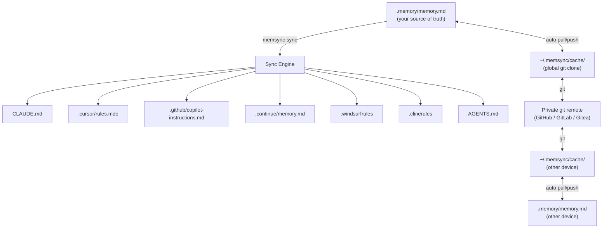
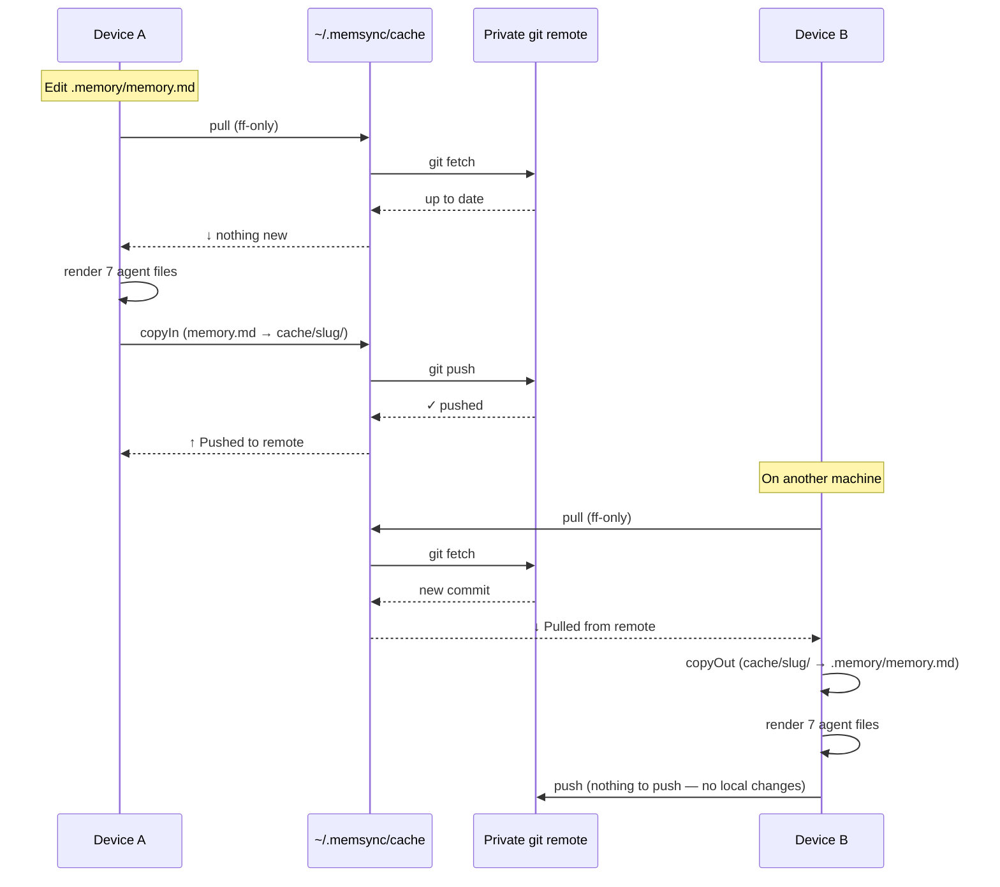

# memsync

Write your AI coding memory **once**, sync to **all 7 agents** — and keep it in sync **across all your devices**.

One markdown file. Seven agent formats. Zero drift.

## How it works



### Cross-device sync sequence



## Why

Every AI agent (Claude Code, Cursor, Copilot, Continue, Windsurf, Cline) has its own memory format. You're trapped:
- Edit memory in Claude Code → forget to sync to Cursor → Cursor acts on stale context
- Switch agents mid-project → lose all previous decisions and context
- Switch machines → your memory stays on the other device
- Maintain 7 separate files across N machines → chaos, inconsistency, nothing syncs

**memsync** solves this: one canonical `.memory/memory.md`, synced to all 7 agent formats, replicated across all your devices via a private git repo.

## Install

```bash
npm install -g @memsync/cli
# or
bun install -g @memsync/cli
```

## Quick Start

```bash
# 1. Initialize in your project
memsync init
# → creates .memory/memory.md scaffold
# → adds .memory/ to .gitignore (stays out of your project repo)

# 2. Edit it with your project context, decisions, architecture notes

# 3. Sync to all agents
memsync sync
# → writes to CLAUDE.md, .cursor/rules.mdc, .github/copilot-instructions.md,
#   .continue/memory.md, .windsurfrules, .clinerules, AGENTS.md

# 4. Check status
memsync status
```

## Cross-Device Sync

Keep `.memory/memory.md` in sync across all your machines via a private git repo.

```bash
# One-time setup (per user, not per project)
memsync remote add git@github.com:you/memories-private.git
# → clones remote into ~/.memsync/cache/

# From now on, `memsync sync` auto-pulls + auto-pushes
memsync sync
# → ↓ Pulled from remote
# → renders all 7 agent files
# → ↑ Pushed to remote

# On a new machine — just run pull first
memsync pull
# → ↓ Pulled from remote (auto-detects project)
memsync sync
# → renders all 7 agent files with your existing memory
```

### How it works

- `.memory/` lives **outside** your project's git history (added to `.gitignore` by `memsync init`)
- A global cache at `~/.memsync/cache/` is a full clone of your private remote
- `memsync sync` pulls before rendering, pushes after — so all machines stay current
- If you have local edits not yet pushed, pull is skipped (your changes take priority)
- Works offline: push/pull soft-fail with `⊘ offline` and sync continues

### Auto pull/push behavior

Auto pull/push is **on by default** once a remote is configured. Config lives in `~/.memsync/config.json`:

```json
{
  "version": 1,
  "remoteUrl": "git@github.com:you/memories-private.git",
  "autoPush": true,
  "autoPull": true
}
```

To disable for a single run:

```bash
memsync sync --no-pull   # skip pull, still push after
memsync sync --no-push   # skip push, still pull before
memsync sync --no-pull --no-push  # local-only sync
```

Pull is also automatically skipped when local edits are detected (to avoid overwriting uncommitted work). In that case, sync pushes instead:

```
⊘ Local edits detected — skipped pull (will push)
  written    CLAUDE.md  (sha abc123)
  ...
↑ Pushed to remote
```

```bash
# Explicit push/pull
memsync push                           # copy → commit → push
memsync push --message "add db notes"  # custom commit message
memsync pull                           # pull → copy to .memory/memory.md

# Manage remote
memsync remote show                    # print remote URL
memsync remote remove                  # unlink (keeps local files)
```

## What Goes in `.memory/memory.md`

Store **project memories only** — context, decisions, architecture, observations about YOUR code:

```markdown
---
version: 1
project: my-app
---

# Architecture

- Backend: Node.js + Express
- DB: PostgreSQL with Prisma ORM
- Frontend: React 19 with Vite

# Key Decisions

## Why we use Postgres instead of MongoDB
- Strong ACID guarantees required for payment flows
- Team expertise skews SQL

## Why we skip TypeScript in tests
- Test code churn too high (types break often)

# Current Blockers

- S3 upload performance timeout at 500MB
- Need to switch to multipart upload
```

**Do NOT store**: linting rules, formatting preferences, workflow how-tos, personal notes.

## Agent Format Support

| Agent | Target File | Format | MCP |
|-------|-------------|--------|-----|
| **Claude Code** | `CLAUDE.md` | Plain markdown | ✓ |
| **Cursor** | `.cursor/rules.mdc` | MDC (YAML + markdown) | ✓ |
| **GitHub Copilot** | `.github/copilot-instructions.md` | Plain markdown | ✓ |
| **Continue** | `.continue/memory.md` | Plain markdown | ✓ |
| **Windsurf** | `.windsurfrules` | Plain markdown | ✓ |
| **Cline** | `.clinerules` | Plain markdown | ✓ |
| **OpenAI Codex** | `AGENTS.md` | Plain markdown | ✓ |

## Scope Directives

Target memory to specific agents:

```markdown
<!-- @scope:claude,cursor -->
## Architecture Notes
Only Claude Code and Cursor see this section.
<!-- @endscope -->

## Backend Setup <!-- @scope:!copilot -->
Everyone except Copilot sees this.
```

- `<!-- @scope:x,y -->` — include only agents x and y
- `<!-- @scope:!x -->` — exclude agent x
- No directive → visible to all agents

## Commands

### `memsync init`
Create `.memory/memory.md` scaffold. Adds `.memory/` to `.gitignore` if in a git repo.

### `memsync sync [options]`
Render to all 7 formats. Auto-pulls before + auto-pushes after (if remote configured).

```
--dry-run        preview without writing
--force          override hand-edited files
--only=x,y       sync only these agent IDs
--no-pull        skip auto-pull
--no-push        skip auto-push
```

### `memsync status`
Show sync status per target: `✓ in sync` | `~ stale` | `! hand-edited` | `✗ missing`.
Shows remote ahead/behind if remote configured.

### `memsync push [--message <msg>]`
Copy `.memory/memory.md` to cache, commit, push to remote.

### `memsync pull`
Pull from remote, copy to `.memory/memory.md`. On fresh machine: auto-detects project from cache.

### `memsync remote add <url>`
One-time setup. Clones `<url>` into `~/.memsync/cache/`. Enables auto-push/pull on sync.

### `memsync mcp`
Start MCP stdio server. Exposes `memory.read`, `memory.search`, `memory.list_targets`, `memory.sync`.

## Drift Detection

Tracks SHA-256 hashes in `.memory/state.json`. On sync: if on-disk hash differs from recorded hash, file was hand-edited → skip (use `--force` to override).

## License

MIT — use freely, modify, redistribute.

## Contributing

1. Fork [TidyMaze/memsync](https://github.com/TidyMaze/memsync)
2. `git checkout -b fix/my-issue`
3. `git commit -am 'Fix X'`
4. Open PR

## Acknowledgments

Built with [Bun](https://bun.sh), [Remark](https://github.com/remarkjs/remark), [MCP SDK](https://modelcontextprotocol.io), [Biome](https://biomejs.dev).
